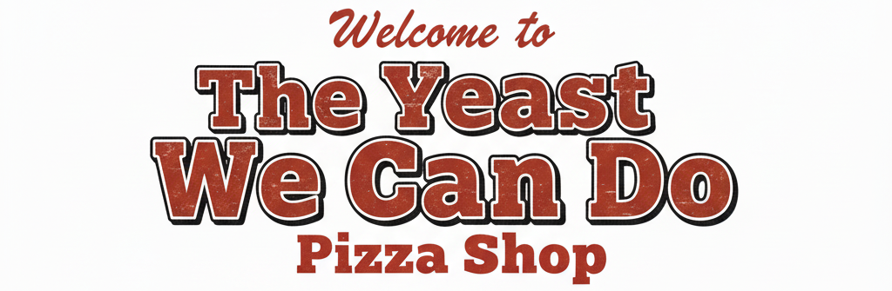
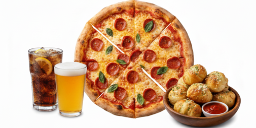

  

  

---

# 🍕 The Yeast We Can Do — Pizza Shop (Capstone Project)
A Java Console-Based Pizza Ordering System

Welcome to _The Yeast We Can Do_, a menu-driven console application where customers can create custom pizzas, add drinks and sides, view their order, and complete checkout. Each completed order generates a receipt saved in the project’s resources/receipts folder using a timestamped filename.
