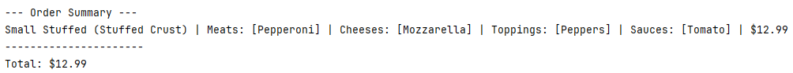
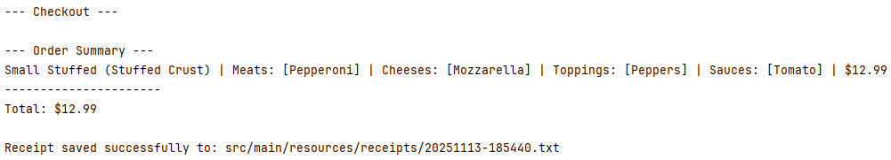
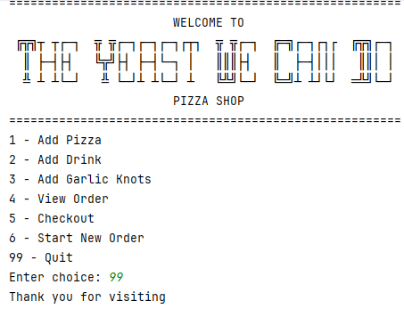
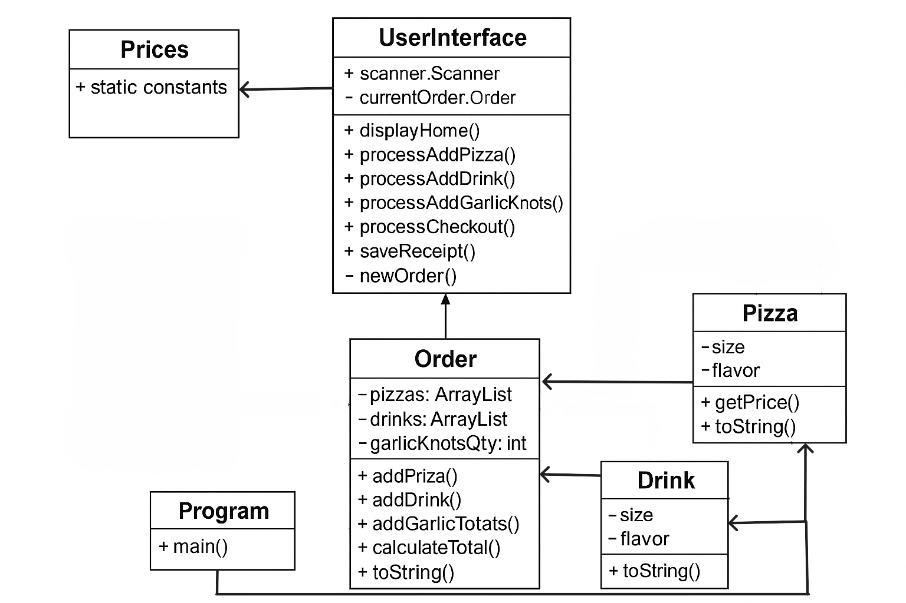

<p align="center">
  
</p>

<p align="center">
  
</p>

---

# 🍕 The Yeast We Can Do — Pizza Shop (Capstone Project)
A Java Console-Based Pizza Ordering System

Welcome to _The Yeast We Can Do_, a menu-driven console application where customers can create custom pizzas, add drinks and sides, view their order, and complete checkout. Each completed order generates a receipt saved in the project’s resources/receipts folder using a timestamped filename.

## 🍽️ Project Features

### ✅ 1. Create a Custom Pizza
*   Choose size (Small, Medium, Large)
*   Choose crust (Traditional, Thin, etc.)
*   Optionally choose Stuffed Crust
*   Add multiple toppings

### ✅ 2. Add Drinks
*   Choose size (Small / Medium / Large)
*   Choose flavor

### ✅ 3. Add Sides
*   Garlic Knots (as many as needed)

### ✅ 4. View Current Order
Displays:
*   All pizzas
*   Drinks
*   Garlic Knots
*   Prices per item
*   Running total

### ✅ 5. Checkout
*   Displays final order summary
*   Saves a receipt for each transaction


## 📺 Application Screens
🔷

🔷




## 📌 Interesting Piece of Code
One part of the project I found interesting was the receipt saving block. My first draft didn't have this included, so I thought I would give it some extra attention.
Every time an order is completed, the program creates a unique text file in the
resources/receipts folder using the exact timestamp of the purchase
(formatted as yyyyMMdd-HHmmss.txt). I don't use timestamps very often and the DateTimeFormatter will always be suspicious to me.
```java
// SAVE RECEIPTS
    private void saveReceipt() {

        // Create filename using date/time
        java.time.LocalDateTime now = java.time.LocalDateTime.now();
        java.time.format.DateTimeFormatter formatter =
                java.time.format.DateTimeFormatter.ofPattern("yyyyMMdd-HHmmss");

        String fileName = "src/main/resources/receipts/" + now.format(formatter) + ".txt";

        try (BufferedWriter writer = new BufferedWriter(new FileWriter(fileName))) {
            writer.write(currentOrder.toString());
            System.out.println("Receipt saved successfully to: " + fileName);
        } catch (IOException e) {
            System.out.println("Error saving receipt: " + e.getMessage());
```


## 📊 Class Diagram
